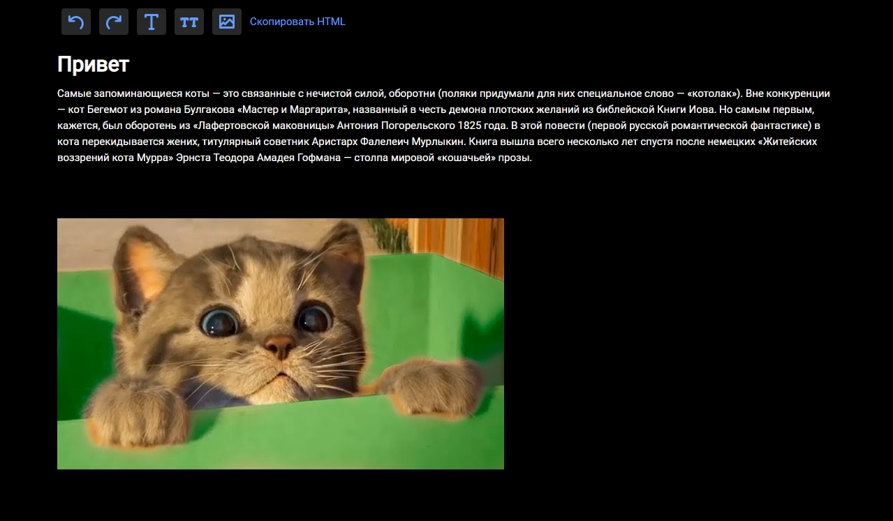

# wysiwyg

<h4>Смотри, что можно сделать с помощью этого приложения</h4>
[I'm an inline-style link with title](https://www.google.com "Google's Homepage")




## Project setup

```
yarn install
```

### Compiles and hot-reloads for development

```
yarn serve
```

### Compiles and minifies for production

```
yarn build
```

### Lints and fixes files

```
yarn lint
```

### Customize configuration

See [Configuration Reference](https://cli.vuejs.org/config/).
